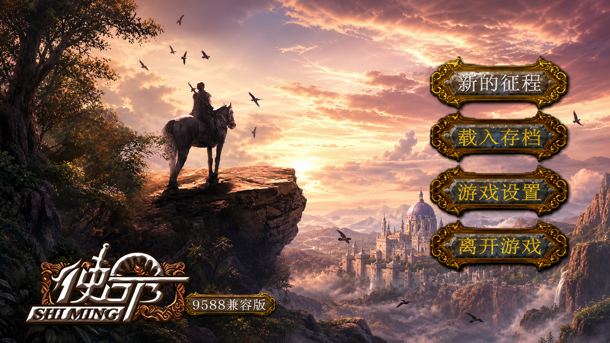

# bbk9588-shiming-port

BBK 9588《使命》S1 移植兼容版



本目录保存 `使命` 从 BBK S1 迁移到 9588 的可用归档版本。

## 目录内容

```text
应用/
  程序/
    使命_9588兼容版_v1.0.bda
  S1原始数据备份/
    使命_S1原始.bda
  数据/
    游戏/
      LYXZ/
        DataLib.dat
        DataLibIndex.dat
assets/
  shiming_icon_logo_transparent.png
  shiming_icon_80x80.png
  shiming_9588_compat_16x9.png
  shiming_9588_demo_preview.gif
  shiming_9588_demo.mp4
scripts/
  README.md
  bda_*.py
  mission_*.py
  s1_font_decode.py
CHANGELOG.md
DATA_NOTICE.md
LICENSE
README.md
```

## 安装方法

把本项目中的以下目录和文件复制到 9588 对应位置：

```text
应用/程序/使命_9588兼容版_v1.0.bda  ->  9588 的 应用/程序/
应用/数据/游戏/LYXZ/                 ->  9588 的 应用/数据/游戏/
```

`应用/S1原始数据备份/使命_S1原始.bda` 只是 S1 原始文件备份，不要放到 9588 的 `应用/程序/` 目录运行。

如果从 GitHub Release 下载 zip，解压后请保持 `应用/...` 目录结构不变。

## 附带脚本

`scripts/` 保存迁移过程中可复用的分析和补丁脚本，包括 BDA header 校验、图标导入导出、API 兼容矩阵、GUI shim、字形内嵌和 S1 字库解码工具。

这些脚本用于研究和复现实验步骤；只安装游戏不需要运行它们。详细说明见 [scripts/README.md](scripts/README.md)。

## 图标资源


- [透明 logo 源图](assets/shiming_icon_logo_transparent.png)
- [BDA 80x80 菜单图标](assets/shiming_icon_80x80.png)

## 演示视频

[](assets/shiming_9588_demo.mp4)

[打开 H.264 MP4 演示视频](assets/shiming_9588_demo.mp4)

## v1.0 可用版本

推荐使用：

```text
应用/程序/使命_9588兼容版_v1.0.bda
应用/数据/游戏/LYXZ/
```

`使命_9588兼容版_v1.0.bda`：

- SHA256：`C2BF69846B8BD8294CED143CF5D5BB8045D3872677E885C5FEB807E2494A8AF3`
- 大小：`1801028` bytes
- 9588 header/checksum：通过
- 标题：`使命`
- 分类：`4`
- 入口 offset：`0x95f8`
- 图标：gpt-image2 高清化使命 logo 版图标，透明区使用 VX/RGB565 `0xf81f` 紫色 colorkey
- 真机结果：可进入主菜单、可进入“新的征程”，文字可渲染

该版本不在运行时读取系统字库，也不调用 9588 字体 reader/FS 字库路径。它把 9588 `HZK_LIB.BIN` 中的 `A1-F7` GBK 区间字形内嵌到 BDA 的 BSS 之后，并额外内嵌半角 ASCII `0x20-0x7e` 的轻量字模。

关键地址：

```text
Mission BSS end     = 0x81d4ced4
GBK glyph table VA  = 0x81d4ced4
ASCII glyph table VA= 0x81dadc84
GUI+0x834 shim VA   = 0x81c8e780
```

## 原始文件

`应用/S1原始数据备份/使命_S1原始.bda`：

- 来源：S1 安装树 `应用/程序/使命.bda`
- SHA256：`C994ED436866FAC9BCC2AB88A5E1ECCAE6C4C33FC91A9C8CFBE9AA3E513262E7`
- 用途：仅用于对照和归档，不能直接在 9588 上运行。

游戏数据目录：

```text
应用/数据/游戏/LYXZ/
```

- `DataLib.dat` SHA256：`8E8A5A4E7B45472841EA4839B5902726AEFE2F53DB7DE7B125CDB039A0CEB85D`
- `DataLibIndex.dat` SHA256：`D321227E79C628F167657F669F043BA230966E224D765C03332A720D6833EC59`

## 为什么 S1 原版不能直接在 9588 运行

### 1. Header/菜单识别格式不同

S1 原始 `使命.bda` 不是 9588 菜单期望的原生 BDA header 布局。

已观察到的差异：

- S1 原版分类为 `6`，9588 兼容版使用分类 `4`。
- S1 原版入口 offset 为 `0x46e4`，9588 当前可识别版本使用 `0x95f8`。
- S1 原版图标区不符合当前 9588 菜单校验路径。
- S1 原版 header checksum 自身可过，但 category/icon/entry 语义不能被 9588 菜单按可运行应用识别。

因此必须重封装 9588 header、分类、入口和图标。

### 2. API 表布局不兼容

S1 `使命` 会调用 S1 GUI/API 表项。9588 中部分同 offset 表项不存在、为空、指向数据区，或语义不同。

关键不兼容点：

- `GUI+0x7fc` / `GUI+0x800`
  - S1 有初始化/配置语义。
  - 9588 不能直接沿用，需要 BDA 内兼容 shim。

- `GUI+0x834`
  - S1 中是字形/字符位图生成函数。
  - 9588 对应 offset 不是可直接调用的兼容函数，直接调用会死机。
  - no-op 版本能进入游戏但文字缺失，说明后续绘制链路可用，缺的是字形生成。

v1.0 保留稳定的 GUI/timing 兼容补丁，并把 `GUI+0x834` 替换为 BDA 内字形 shim。

### 3. 字库路径和编码逻辑不同

`使命` 需要的是 S1 风格 12x16/24-byte GBK 字形。已验证 9588 `HZK_LIB.BIN` 可以按 S1 方式解出正确字形：

```text
offset = 0x1a84b0 + gbk_index * 24
gbk_index = high * 190 + low - (low < 0x80 ? 0x5ffe : 0x5fff)
glyph = 24 bytes
```

但以下运行时字库方案真机不可用：

- `hzk_reader`：调用 9588 内部 `0x8017a200(dest, offset, 0x18)`，真机直接死机。
- `hzk_fs`：在 `GUI+0x834` 中 open/seek/read `HZK_LIB.BIN`，真机直接死机。
- `hzk_cache/preinit`：运行期 alloc/read 整个字库，真机在宠物管家后或进入正文前死机。

当前可用方案是把所需字形直接内嵌到 BDA，运行时只做内存查表和 24-byte copy，不再依赖系统字体 API 或 FS。

## 版权和数据说明

本项目是 BBK 9588 兼容性迁移和逆向研究归档。原始游戏程序、数据、美术和相关资源版权归原权利方所有。本仓库不声明拥有原游戏版权，也不提供商业授权。

详细说明见 [DATA_NOTICE.md](DATA_NOTICE.md) 和 [LICENSE](LICENSE)。
